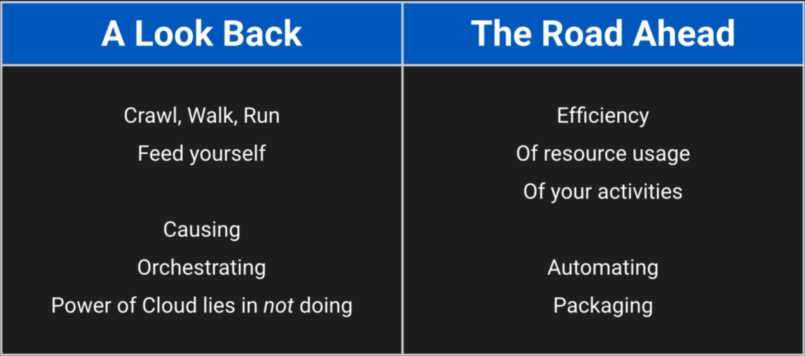
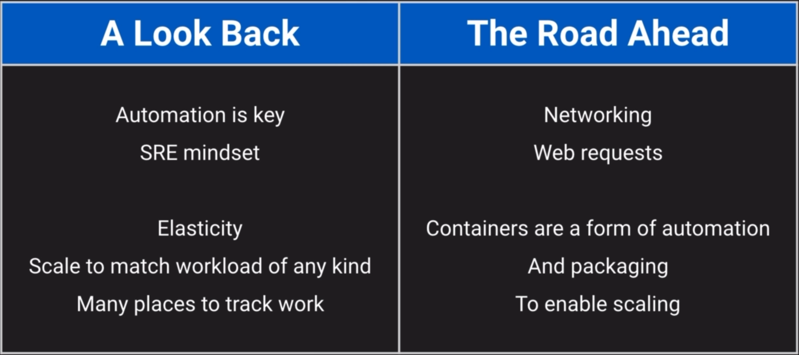
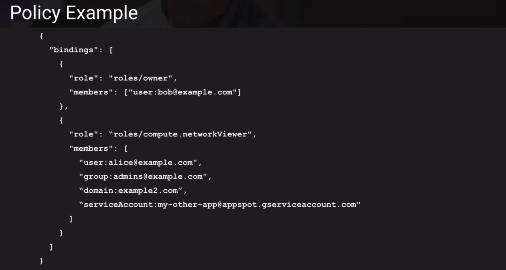

<h2 align="center"># GCP Architect Learnings   - Storage </h2>

<h2 align="center">1. Creating buckets</h2>

Native Google Cloud storage addresses start with gs://  
Just like web addresses start with https://

Used for:  
`Uploading & managing objects` \ 
`(Public and Private)`
   

 
Storage Bucket types

 ➟ Multi-Regional 
  ・These buckets are designed for storing data that requires high availability and low latency access from multiple regions.
   
 ➟ Regional 
  ・for redundancy. Regional buckets are ideal for applications that have regional data requirements, such as analytics, backups, and content distribution within a specific geographic area.
   
 ➟ Nearline 
  ・for storing infrequently accessed data that may need to be accessed within seconds or minutes. with a slightly higher access latency. This type of bucket is suitable for data that needs to be available for quick retrieval but is not accessed frequently, such as backup archives, disaster recovery data, and long-term storage. 
	  -- Parallel composite uploads: split the file into multiple parts and upload them simultaneously, enabling multiple TCP connections to transfer the data concurrently. This approach allows the bandwidth to be fully utilized, and the file can be uploaded much faster than with a single connection.
	  -- command-line tool like gsutil supports parallel composite uploads
   
➟ Coldline 
  ・designed for long-term archival storage of data that is rarely accessed. accessed no more than once per year, such as regulatory or compliance archives, historical records, and large-scale data archiving.
   

   
---
<h2 align="center">2. Commands for storage</h2>

<pre>
- Gsutil connects to google cloud storage
- Double star lists out files even from folders 
   - gsutil ls gs://bucket-name/**
- Make Bucket
   - gsutil mb ( -l location-name) (gs://bucket-name)
- gsutil label (get gs://)[to view] 
   - (get gs://bucket > bucketlabels.json)[to export] 
   - (set bucketlabels.json gs://)[to set from file] 
   - (ch -l "key":"key" gs://bucket)[shortcut to add to existing labels]
- Check file versioning. Off by default. NOT possible on Console, only on CLI
   - gsutil versioning get gs://
   - Enable = gsutil versioning set on gs://
- View file Version with the generation-number even after its deleted
   -  gsutil ls -a gs:// 
- Make object public
   - gsutil acl ch -u AllUsers:R gs://bucket/img.jpg
     - acl = access control, -u =user, R = read 
</pre>

<h2 align="center">3. Commands for shell</h2>

<pre>
-- gcloud config get-value project
-- gcloud services list --project <PROJECT> [see enabled APIs]
-- gcloud services list --enabled [also see enabled APIs]

-- gcloud services list --available | grep compute
-- gcloud compute instances create vm-name
-- screenshots  
-- gcloud compute instances list [see existing vms]
-- gcloud compute machine-types list
-- gcloud topic filters [we'll use it instead of grep so to remove paid f1 zones like north Virginia].
-- 
-- CREATING VM ⬇
-- gcloud compute machine-types list--filter="NAME: f1-micro AND ZONE~us-west" [free tier]
-- gcloud config set compute/zone us-west2-b
-- gcloud config set compute/region us-west2
-- ⮕ gcloud compute instances create-machine-type=f1-micro vm-name
-- ping-c 3 $external_ip_of_vm [name or internal ip didn't work]
-- 
-- SSH INTO VM ⬇
-- ssh $external_ip [this doesn't work]
-- ⮕ gcloud compute ssh $vm_name [this works]
-- {A public and private ssh key is now created. Public key can be viewed from Compute Engine ↠ Metadata ↠ SSH keys. That key is now registered. So any future instances they get created will automatically know to accept this for log in.}
-- 
-- CHECK SESSION IP ⬇
-- ⮕ curl api.ipify. org 
-- 
-- Where our Public KEY is saved ⬇
-- {After our first time ssh, two files: google_compute_engine (encrypted PRIVATE KEY) & google_compute_engine.pub (PUBLIC KEY) files are created into .ssh directory. Both are needed to ssh into the machine}
-- whoami ➟ owner details
-- hostname ➟ current user
-- 
-- HOW DOES VM KNOWS OUR PUBLIC KEY: ⬇
-- (run inside ssh)
-- cd .ssh/ ➟ cat authorized_keys [Contains our PUBLIC KEY]
-- curl-H "Metadata-Flavor:Google" metadata. google.internal/computeMetadata/v1/$
-- $/instance/name [our vm name]
-- $/project/attributes/ssh-keys [this contains the key that identifies us, OUR PRIVATE KEY]
-- $/project/project-id [this tells our project name]
-- $/instance/service-accounts/default/ [see info about the service account for this VM instance, like aliases, email, identity, scopes, token]
-- gcloud config list [see metadata for our project]
-- 
-- DELETE INSTANCE: ⬇
-- gcloud compute instances delete myhappyvm
</pre>

<h2 align="center">4. GCP Console - Compute Engine</h2>

<pre>
[N1 Machine types and all others](https://cloud.google.com/compute/docs/general-purpose-machines#n1_machine_types)

When creating a Compute Instance,  
⮕ In the Identity and API access section  
We have our Service Account selected to give VM access to Google services.  but an interesting and important thing to understand is that even when we've given access to a particular service account  these access scopes restrict what you can do with it.  
If you look at the "Access scopes" under Service Account,   ⮕ By default you only get read access to Google cloud storage and you don't actually get access to Google compute engine  which is why we were unable to terminate the instance that we were using when we shelled into it. 
If you want you can "[x]Set access for each API" to send access on a service-by-service basis. 
Or [x] Allow full access to all Cloud APIs. Which we will choose for this exploration lab. 
⮕ Here are some Default Scope settings and the Best Scope Practices: https://cloud.google.com/compute/docs/access/service-accounts#default_scopes
⮕ All access scopes: https://developers.google.com/identity/protocols/oauth2/scopes
⮕ Now if you try to delete VM after ssh-ing, you can see in the activity logs  That the last two activities to delete the VM were performed by the service account being used by compute engine instance,  and not our user account.
example: 339365196943-compute@developer.gserviceaccount.com deleted myvmname.

⮕ There is an option to Enable deletion protection, which is not always the best practice.  
Also, there is another checkbox,  "[x]Delete boot disk when instance is deleted" which is ticked,  because the default behavior is not to be preserving these instances,  you start them up -> They do some stuff -> they go away.  Going away should be fine because the doing some stuff part should always be writing everything that matters somewhere else.  
Now to store things, we can add persistent disks, but that doesn't go well with auto scaling,  so you often want to use a separate service to store the data instead. 

⮕ Now in the advanced settings section of compute settings: 
we also have a "Security" tab and here's where we could override the project level settings about SSH keys  and block them from being used and add custom ones just for this instance. 
You might want to use this if you have special machines
that shouldn't be available to most people in the project  or some machines where you want to allow specific access to those machines and not the others.

Now for the disks, remember that the default behaviour is to delete the boot disk whenever the instance goes away  though you could either add a new one or attach an existing persistent disk that you had created.  
For Key's encryption, It's generally easiest to let [x]Google manage the keys 
And if possible though, you should try to avoid [x]Customer-supplied key, i.e, having to manage the keys yourself outside of Google.

⮕ For Security features, If we go to the ➟ menu ➟ to Compute ➟ look at Metadata ➟ and then switch to the SSH keys tab.  
We'll see new Public SSH KEYs added every time when we ssh from the CONSOLE, as a part of connection from the console to the instance. 
After running "gcloud compute ssh" the public key is put in this project metadata spot  and it stored the private key on the file system that was running gcloud  which happened to be cloud shell in our this case.  
But when ssh=ing from console, look at the new keys added... 
They have a new "expireOn:" tag at the end, so Google will automatically remove these keys in a short while.  They last long enough for us to make the connection to the instance  but not long enough for them to become an issue of someone stealing these credentials and using them to mount an attack.

</pre>
A preemptible VM instance, short for preemptible virtual machine, is a type of virtual machine that can be interrupted or terminated by the cloud provider at any time, typically after 24 hours of uptime. The main advantage of using preemptible VMs is their significantly lower cost compared to regular VMs.

→ Service Accounts: https://cloud.google.com/compute/docs/access/service-accounts  
→ VM instance lifecycle: https://cloud.google.com/compute/docs/instances/instance-life-cycle  
→ About VM metadata: https://cloud.google.com/compute/docs/metadata/overview#waitforchange  
・Note: We cannot pull logs from instance, The instances are set up to push their logs to Google Cloud operations (formerly Stack-driver) through the agent.  
Note: Metadata service uses the http service, not https  
・Tip: If a startup script for a newly created GCE instance did not run at all, to help investigate this problem, we can a)Press the SSH button on the instance Details page in the console.  & b) Check the machine's syslog.  
Note: GCE console's monitoring tab has information that it can get from the hypervisor so we can see things like CPU usage  but it cannot see error messages logged by the startup script.

The real world is not about following instructions that someone else gives you,  The real world is about figuring out what needs to be done and doing it. 

<h2 align="center">5. Scaling / Auto-Scaling</h2>

<pre>
We can use INSTANCE GROUPS to manage the scaling of our infrastructure.
➟ Un-Managed Instance Group type   requires us to manually monitor the VM load, then CREATE New VMs manually and add them to the group accordingly.  
・We have to switch to "[x]Single zone" to be able to have an unmanaged instance group. 
・We have to manually stop the instances when they are not being used.  
・When deleting Un-Managed Instance Group, instances are not automatically deleted and need to be further deleted manually. 

⭐ ➟ Managed instance Groups are created by using INSTANCE TEMPLATES only. 
・We have to switch to "[x]Multiple zones" to be able to have a managed instance group. 
・It automatically scales and stops the instances as per the requirements and the set specifications.  
・Deleting a managed instance group will delete all of its instances because it owns them. 
・In normal circumstances, we want the cooldown period to be set longer than the total amount of  time it takes to start up the instance and finish running its startup script. 
・Health Check: This is about ensuring that the instances are healthy enough to do the work they need to do.    If you imagine that you're running a program to pick up work packages, but something went wrong with it, and it crashed...   That won't necessarily shut down the machine, but if you have a health check that is continually asking: Are you still alright? What about now? Everything Good?    Then, if it doesn't get a positive response, it can say all right, there's something wrong with you, You need to be refreshed.    It'll delete the problematic machine and create a new one from template. 
The `On-host maintenance` option to Migrate VM instances ensures that your VM instances will be highly available during system maintenance. When Google Cloud Platform needs to perform maintenance on the physical host where your VM instance is running, the instance will be automatically migrated to a new host, without any disruption to your application.
   

😃 Autoscaling is much better than manually managing instances  😃 Everything depends on reliable automation 😌 Load balancing is separate from auto-scaling. (See Section 7)
</pre>

<h2 align="center">6. Security - (Need to Re-Study to improve notes)</h2>

<pre>
Security means Ensuring proper data flow.
Not too much; not too little.
 
What is "proper" data flow? (CIA Triad)
→ You cannot view data you shouldn't 
(making sure that only the right people can see certain data is Confidentiality)
→ You cannot change data you shouldn't 
(Being able to trust that the data hasn't been changed inappropriately is Integrity)
→ You can access data you should 
(Being able to get at the data and use the system when you do need to is Availability)
 
How do we control data flow? (AAA)
・ Authentication: Who are you?
・ Authorization: What are you allowed to do?
・ Accounting: What did you?
 
Key Security Products/Features:
➟ AuthN (authentication)
・ Identity - Humans in G Suite, Cloud Identity
            - Applications & services use Service Accounts
・ Identity hierarchy: Google Groups
・ Can use Google Cloud Directory Sync (GCDS) to pull from LDAP (no push)
 
➟ AuthZ (Authorization)
・ Identity hierarchy (Google Groups)
・ Resource hierarchy (Organization, Folders, Projects)
・ Identity and Access Management (IAM): Permissions, Roles, Bindings
・ GCS ACLs
・ Billing management
・ Networking structure & restrictions
 
➟ AccT (Accounting)
・ Audit Activity Logs (provided by Stackdriver)
・ Billing export - To BigQuery
                  - To file (in GCS bucket): Can be JSON or CSV
・ GCS Object Lifecycle Management
------------------------------------------------ 
⮕ IAM Resource Hierarchy [AuthZ]
Organization (Tied to G Suite or Cloud Identity domain)
 ↆ 
Folder (Contains any number of Projects and Subfolders)
 ↆ
Project (Container for a set of related resources)
 ↆ
Resource (Something you create in GCP)

⮕ Permissions: allows you to perform a certain action In the IAM world,
-- Each permission follows the form ➟ Service.Resource.Verb
-- for example: pubsub.subscriptions.consume.

⮕ Role: is a collection of Permissions to use or manage GCP resources. 
-- Primitive Roles: Project-level and often too broad
 ・ Viewer: read-only
 ・ Editor: view and change things
 ・ Owner: can also control access & billing
-- Predefined Roles Give granular access to specific GCP resources
 ・ E.g.: roles/bigquery.dataEditor, roles/pubsub.subscriber

⮕ Roles Overview: https://cloud.google.com/iam/docs/roles-overview  ⮕ Complete List of Roles & Permissions: https://cloud.google.com/iam/docs/understanding-roles#basic

⮕Member: A Member is some Google-known identity identified by a unique email address

-- user: Specific Google account (can be G Suite, Cloud Identity, Gmail, or any validated email)
-- serviceAccount: used by apps/services (not by humans)
-- group: is a named collection of Google accounts and service accounts. (giving developer access) 
-- domain: for when you want to grant access to some resource to every single account in a particular domain.  That domain needs to be managed by G Suite or Cloud Identity
-- allAuthenticatedUsers: Resource is Public but needs some Google account or service account. (The only difference is that you can tie actions back to some user account which is what makes this different)
-- allUsers: Anyone on the Internet, no authentication needed, completely anonymous access is fine. (Public)  
- Group should be the default choice always
- Use them for everything!
- You can even use a group to be the owner of projects when you have an organization.
- And to be able to manage the groups effectively in an organization, you can nest them.  So for example you might want to have one group for each department and then have another group called all staff. This is good because every employee will be in some department so they'll always be included in the all staff group. And it's a lot less work to manage adding and removing employees this way than going and finding each and every one of the groups that they should be a part of.

⮕ Policies
・Each resource can have exactly one policy attached to it.
・By default Resources generally have an empty policy attached to them.
・Now in that one policy per resource you can have a maximum of 1500 member bindings. It should never get to that number. Always use group.
・Policies are Always additive ("Allow only") and never subtractive (no "Deny"). 
 Source: https://cloud.google.com/iam/docs/overview

Note: Manual work Not Preferred = Can use get-iam-policy, edit the JSON/YAML, and set-iam-policy back.
[Prefer "add-iam-policy-binding" & "remove-iam-policy-binding"]
ADDING A POLICY ⬇
⮕ gcloud [GROUP] add-iam-policy-binding [RESOURCE-NAME]
 --role [ROLE-ID-TO-GRANT] --member user: [USER-EMAIL]
REMOVING A POLICY ⬇
⮕ gcloud [GROUP] remove-iam-policy-binding [RESOURCE-NAME]
 --role [ROLE-ID-TO-REVOKE] --member user: [USER-EMAIL]

➟ example 1: 
 gcloud compute instances add-iam-policy-binding my-instance
 --role roles/compute.instanceAdmin
 --member user: me@example.com  
➟ example 2: 
 gcloud compute instances add-iam-policy-binding my-instance --zone=ZONE --member='user:test-user@gmail.com' --role='roles/compute.securityAdmin'

Best Practices: Using IAM Securely= https://cloud.google.com/iam/docs/using-iam-securely

BILLING IAM ROLES ⬇
・Billing Account Creator = Create new self-serve billing accounts (Scope= User at Org level)
・Billing Account Administrator = Manage billing accounts (but not create them). (Scope= User at Billing Account level)
・Billing Account User = Link projects to billing accounts. (Scope= User at Billing Account level)
・Billing Account Viewer = View billing account cost information and transactions. (This role could let you audit what's going on but not change anything.)
・Project Billing Manager = Link/Unlink projects to a billing account. (Scope=Project level)

</pre>

<h2 align="center">7. Networking = Routing</h2>

<pre>
Don't think in terms of connections and networks.
Instead, think about how each piece of data makes its journey from place to place.
・Routing is about deciding where data should go next.
  ⮕ READ: Cold Potato vs Hot Potato Routing https://en.wikipedia.org/wiki/Hot-potato_and_cold-potato_routing 

 ⮕ READ: Networking tears https://cloud.google.com/blog/products/networking/introducing-network-service-tiers-your-cloud-network-your-way  
Let's take a look at how data makes its way from the front door of Google's network to the correct resource in our system.

⭐ Reasons to direct data flow to different resources:
~~ Latency reduction = Use servers physically close to clients. (You want your system to respond quickly to users. So it's good if your servers are physically close to them.)
 -- Use Cross-Region Load Balancing (with Global Anycast IPs)
  ⮕ READ: Routing schemes (Unicast,Anycast, etc) https://en.wikipedia.org/wiki/Routing 
~~ Load balancing = Let's say you have too many incoming requests to be handled by just one machine. So you add a second machine to help out, but there's no point in doing that if all of the incoming requests still go to the overloaded machine, right? That's why we need load balancing to divide the requests amongst the machines that can handle them. 
 -- Use Cloud Load Balancer (all types; internal and external)
 -- (So Load balancing is Separate from auto-scaling to handle fluctuating workloads. Yes, they work well together, but it would be best to keep a mental model that has them related, not entirely overlapped.)
 ⮕ READ: https://cloud.google.com/load-balancing/docs/load-balancing-overview 
~~ System design = You might have different servers in your system handling different parts of that system. And this is especially true when your service is composed of micro services rather than all jammed together (in a monolith).
 -- Use HTTP(S) Load Balancer (with URL Map)
 -- (If you imagine something like an online store, you might have some systems that handle the item catalog, maybe other systems that know about the current inventory levels, and yet different systems that handle user data like past orders that they we placed or maybe even what's in their cart right now.)
 -- This supports SSL/TLS offloading unlike others, allowing the load balancer to terminate SSL sessions and decrypt traffic before forwarding it to the backend instances. It has several benefits, such as improved security, reduced CPU load on backend instance 
~~ Layer 4 vs. Layer 7
 ⮕ READ: 7 layers of OSI https://www.webopedia.com/definitions/7-layers-of-osi-model/
 -- Layer 4 only knows IPs (TCP/IP layer) and cannot route based on the URL paths defined in L7
 -- Layer 7 knows HTTP and HTTPS URLs and Paths.
     -- Question= Why not use Layer 4 with DNS? DNS knows all the paths right? 
     -- Answer= No, 1) DNS only returns a Layer 4 IP address, and doesn't know full URLs. 2) DNS lookups tend to be sticky, i.e, they lock on to a single machine, and they'll never stop trying to connect to that machine until TTL expires even if it's overloaded or dead (TimeToLive= how long that particular DNS lookup as valid). Conversely, If TTL is too short, like 0-1 second, means every single connection has to redo the DNS look up which is also costly, because each request includes another round-trip which is also slower. 3) Not Robust - Relies on the client always doing the right thing which they don't. 
~~ Getting data from one resource to another
 -- VPC Network (Global) is used

why do we need vpc in google cloud?
= A Virtual Private Cloud (VPC) is important in Google Cloud for several reasons. Firstly, it provides a secure and isolated environment for your resources. With a VPC, you can create *multiple subnets and control network access using firewall rules, helping to protect your data from unauthorized access. Additionally, a VPC allows for easy scalability and flexibility. You can expand your network by creating new subnets or adding more resources, without affecting other parts of your infrastructure. This enables efficient resource management and cost optimization. Furthermore, having a VPC enables you to establish VPN connections to securely connect your on-premises network to your Google Cloud network. This allows for hybrid cloud scenarios.
~~ Shared VPC: In a scenario where you have multiple projects within a GCP Organization and you need to enable communication between resources in different VPCs or projects, using a Shared VPC is a recommended approach. A Shared VPC allows one project (the host project) to host the VPC network, while other projects (service projects) can attach their resources to this shared network.
- Shared VPC lets you map each tier of the web service to different projects so that they can be managed by different teams while sharing a common VPC network: Resources, such as instances and load balancer components, for each tier are placed in individual service projects managed by different teams.
Organization Requirement: To use Shared VPC, both projects must be part of the same GCP Organization. This ensures that they are under centralized management and billing.

 -- Virtual Private Cloud = This is your private software-defined networking space in GCP.
 -- Not just resource-to-resource, it also manages the doors to outside & peers. It defines the overall network.
 -- Inside of it, we need subnets to divide up that space.
 -- Subnets are regional = meaning that a single subnet can be used by multiple resources across all of the availability zones in a region.
       -- But even though the subnets are regional, they're all still globally connected.
       -- Means all Subnets can reach all others globally without any need for VPNs.
       -- After you create a subnet, the primary IPv4 range for the subnet can be expanded but not replaced or shrunk. How to: [expand subnet](https://cloud.google.com/vpc/docs/create-modify-vpc-networks#expand-subnet)
⭐READ: [Subnet Rules](https://cloud.google.com/vpc/docs/create-modify-vpc-networks#subnet-rules)
[Valid IPv4 ranges](https://cloud.google.com/vpc/docs/subnets#valid-ranges)
 -- Routes (global) define "next hop" for traffic based on destination IP, and apply by Instance-level Tags, not by Subnet.
 -- Firewall Rules (global) further filter data flow that would otherwise route. Default Firewall Rules are restrictive inbound and permissive outbound.
 -- ⭐ By Default, egress is permitted and ingress is not!(so ingress requires a firewall rule with a target and source and a port)
 -- VPC peering: is a networking connection between two VPCs that enables routing using each VPC's private IP addresses as if they were in the same network. VPC peering connections can be created between your own VPCs or with a VPC in another GCP account. 
 -- VPCs are Global and subnets across different regions can be accessed using private IPS, no Peering/VPN setup required.
 -- Connecting subnets: Create the new instance in the new subnetwork and use the first instance's private address as the endpoint.

~~ IPV4 address = is abc.def.ghi.jkl (dotted quad) where each piece is 0-255 (This is derived from the 8 bits available for host addresses (2^8 = 256))
      -- Bits are the smallest unit of data in computing. They only have two possible values - 0 or 1. An IP address is made up of 32 bits divided into four octets (or bytes). Each octet is made up of 8 bits.
      -- The reason why 8 bits correspond to 256 values is due to how binary math works. With 8 bits, you have 2^8 or 256 possible combinations. This is because each bit position can be either a zero or a one, so each bit doubles the number of possible combinations.
      -- Here is how it looks: [2^0 = 1 (binary: 00000001)] + [2^1 = 2 (binary: 00000010)] + [2^2 = 4 (binary: 00000100)] + [2^3 = 8 (binary: 00001000)] + [2^4 = 16 (binary: 00010000)] + [2^5 = 32 (binary: 00100000)] + [2^6 = 64 (binary: 01000000)] + [2^7 = 128 (binary: 10000000)] = If you add all those up (1 + 2 + 4 + 8 + 16 + 32 + 64 + 128), or go straight to 2^8, you get 256.
      -- So, with 8 bits, the values can range from 0 (all bits are 0) to 255 (all bits are 1), providing 256 total possible values.

~~ CIDR block is group of IP addresses (Classless Inter-Domain routing Block, full form I'm not sure if important for exam but it's cool to remember anyways)

      -- Each IP range is 8 Bit binary number. 8x4 Totals to 32 bit per IP address in subnet.
      -- IP.IP.IP.IP/32 means Single IP = as all 32 bits are locked.
      -- IP.IP.IP.0/24 means there are 256 possible IP addresses within the subnet = because last 8 bits are free (represented by the "/24") & can take on 256 different values (0 to 255). 2^8=256 (where 2 represents binary possibility of 0 or 1)
      -- IP.IP.0.0/24 also means there are 256 possible IP but you can break this CIDR block into two subnets, each supporting 128 IP addresses.
      -- However, typically the first address (e.g., IP.IP.IP.0) is reserved as the network address and the last address (e.g., IP.IP.IP.255) is typically reserved as the broadcast address. So, in practical usage, there are typically 254 assignable IP addresses for hosts in a /24 network.
      -- IP.IP.0.0/16 = In the given IP address range, the "/16" refers to the subnet mask, meaning the first 16 bits of the IP address are designated for the network, and the remaining 16 bits are for host addresses. Given this, there are 65,536 possible IP addresses because 2^16 equals 65,536 -minus (first address reserved for the network address, and last for broadcast address) = practically 65,534 assignable IP addresses.
      -- IP.0.0.0/8 means there are a total of 16,777,216 possible IP addresses since 2^24 equals 16,777,216. Practically -minus 2 = 16,777,214.
      -- 0.0.0.0/0 means "any IP address" because no bits are locked. 
    ⭐ Note: If you create more than one subnet in a VPC, the CIDR blocks of the subnets cannot overlap.
    -- For example, if you create a VPC with CIDR block 10.0.0.0/24, it supports 256 IP addresses. 
    -- You can break this CIDR block into two subnets, each supporting 128 IP addresses. 
    -- One subnet uses CIDR block 10.0.0.0/25 (for addresses 10.0.0.0 - 10.0.0.127) and 
    -- the other uses CIDR block 10.0.0.128/25 (for addresses 10.0.0.128 - 10.0.0.255).

 ~~ Creating VPCs
   -- Activate these firewall rules while creating a Auto-subnet mode VPC
	   -- my-auto-vpc-allow-icmp (imp allows to ping the machine, trace route and also quite valuable for diagnostics)
     -- my-auto-vpc-allow-internal (this allows internal traffic to be accepted inside the VPC)
     -- my-auto-vpc-allow-rdp (to allow rep connection)
     -- my-auto-vpc-allow-ssh (it uses the port 22 and allows us to ssh to the instances we create) (since default behaviour is to allow all incoming requests due to 0.0.0.0/0, which should not be a problem as long as our ssh keys are safe, still if we want more security then we can create a custom firewall rule to allow specific IP also).
   ~~ In Custom VPC
	   -- Add a name and region
	   -- In IP address range, we can add a private IP address ranges that are defined by RFC 1918 like 192.168.0.0/24 
		   -- (RFC 1918 refers to a set of standards defined by the Internet Engineering Task Force (IETF) that specifies IP address ranges that are reserved for private use. These IP address ranges are not routable over the internet and are intended for use in private networks such as local area networks (LANs) or virtual private networks (VPNs). 
		   -- The three IP address ranges defined in RFC 1918 are = 10.0.0.0 to 10.255.255.255 (10.0.0.0/8) - This range allows for approximately 16 million private IP addresses. It is typically used for larger organizations or networks.
		   -- Or = 172.16.0.0 to 172.31.255.255 (172.16.0.0/12)) - This range allows for approximately 1 million private IP addresses. It is commonly used for medium-sized networks.
		   -- Or = 192.168.0.0 – 192.168.255.255 (192.168.0.0/24)
	   -- In secondary IP range:
		   -- Private Google access, means that you can connect to Google services even without being able to connect out to the Internet. (Can leave off)
		   -- turning on Flow logs, would give us pretty detailed information about all of the traffic that's happening on this subnet. (Can leave off)
			-- For Dynamic routing mode, Can choose Global this time instead of Regional, you ever connect a VPN to this VPC because that way you'll more easily be able to access all of the subnets across the world.
	⭐ NOTE: To allow incoming traffic like to ping our instances: create firewall rule=
	
	
	-- We would generally be allowing TCP traffic on port 80 (or 443 for web traffic, or 3306 to access mySQL). So that HTTP and HTTPs connections can be made to these instances.
	-- But if I want to focus on the network traffic only and not on setting up web servers, So I'm just going to say that ICMP like ping is what we're using to test the connections.
	
	-- To allow SSH using VPC, create a Firewall rule with a Network tag and port 22 in tcp. Then add that Network tag to our instance.
	  
	~~~~ Create a Service Account with a Custom Role
		-- Go to IAM > Roles, filter the roles like: Title *writer* 
			-- eg: Logs Writer, Monitoring Metric Writer
			-- note: If google updates details in any Selected Role in future, it won't be automatically updated in our created Custom Role. To update it, just update the "ID" tag while editing our role.
		-- choose required roles, and click create
		-- you can manage custom roles through a lifecycle, but we don't really need to do that at always so we're just going to set the "Role launch stage" to general availability.
		-- Delete Default service account from IAM > Service acc
		-- Create a new one with our custom role :)  
	~~~~ Creating a new Instance Template with custom role
		-- In "Identity and API access" choose the new custom Service account.
		-- we're not prompted to set the access scopes, because access scopes really only apply to the default service account. (For custom service acc, google assumes that the permissions that we've granted are all we want.)
		-- Expand the "Advanced options" and switch over to the "Networking" tab.
		-- set our VPC in "Network" and our custom subnet in "Subnet"
		~~~~ Creating a new Managed Instance Group
			-- (choose Multiple zones) and a region 
			-- Choose our instance template
			-- Although when if there's not use of much CPU, we'll just leave most of these defaults but set our minimum instances to two and our maximum to three that's all.
			-- create.
When done with everything regarding work, Disable autoscaling and set "Number of instances" to zero to delete the instances and save money.
</pre>

<h2 align="center">8. Kubernetes (will refine later)</h2>

<pre>

We can use Deployment Manager to create a Google Kubernetes Engine cluster.

The atomic unit for a virtualisation environment is the VM, while the atomic unit for a Kubernetes environment is the pod, so the smallest thing you can deploy on a Kubernetes cluster is a pod.
But inside of each pod is one or more containers anyway.
Application code exists in containers and,
containers run in pods on Kubernetes.

Well the pod is an object on the cluster and it's defined in the API as a resource under the v1 core API group.

~~ To see running pods/ 
/check the status of the deployed pods:
$kubectl get pods
or
$kubectl get pods -l containerName=myContainerName (-l specifies the label selector to filter Pods based on the specified container name.)
example= kubectl get pods -l app=myapp

we wrap them in a high level object called a deployment.
This again is an object on the cluster and it's a resource in the apps/v1 API group.
Now the whole idea of deployment is to make pods cool.
Well it's not really, it's to make them scalable, making
rolling updates and rollback simple, and a ton of cool stuff.
= Deployment objects are used to manage stateless applications that can be scaled up or down.
So kind of cool but really it's about being flexible and more useful.
So pods and deployments exist in the api and They can be deployed on the cluster as objects.
Deployments are great for scaling and updates but other objects exist for wrapping your pods.

A DaemonSet is a Kubernetes controller that ensures that all or some nodes in a cluster run a copy of a specific pod. The DaemonSet creates a replica of the pod on each node in the cluster, ensuring that the pod is running on every node.
So daemon sets make sure that one and only one of a specific pod will run on every worker in the cluster.
= eg, Deploying the monitoring pod in a DaemonSet ensures that a copy of the pod runs on each node in the cluster, it ensures that metrics are collected from every node in the cluster.

A Type Provider is essentially a plugin or extension that lets you define and use custom resource types in your Deployment Manager configurations. These custom resource types can represent anything you want, not limited to Google Cloud services. This allows you to create, update, and delete instances of these custom resource types as part of your deployment.
Example Use Cases: Type Providers are helpful in scenarios where you need to interact with external systems or resources. For example, if you're managing a Kubernetes cluster using Deployment Manager, you might create a custom Type Provider to represent Kubernetes resources like Deployments, Services, or DaemonSets.
They can simplify complex resource management and make your Deployment Manager configurations more readable and maintainable.

StatefulSet objects are used to manage stateful applications that require unique, persistent identities and stable network identifiers.

Cluster initializers are used to perform additional configuration of a Kubernetes cluster before the objects are created.

kind: Service = loadbalancer
 Spec:
 type: LoadBalancer
 
 Load balancer = a cloud-based load balancer and then integrates that with the service on your cluster.
 
 It is good practice to use 'Secret object' for storing confidential data like in YAML configuration files like API keys or passwords.
 ConfigMap object are used for non-confidential data like port numbers.

~~ Kubernetes Service of type ClusterIP: 
- Cluster IP is the default service and it's the most basic.
Now that means if you see a manifest file that doesn't actually specify a type you're going to be getting cluster IP.
Creating a Kubernetes Service of type ClusterIP is not suitable for exposing your application to the public, as ClusterIP services are only accessible within the cluster.

~~ Kubernetes Service of type NodePort: 
NodePort allows you to expose your application on a specific port on each node in the cluster. This is a common way to make services accessible within a cluster.
Eg, You are using Google Kubernetes Engine with autoscaling enabled to host a new application.
You want to expose this new application to the public, using HTTPS on a public IP address.
Ans. You can create a Kubernetes Service of type NodePort for your application, and a Kubernetes Ingress to expose this Service via a Cloud Load Balancer.

~~ Kubernetes Ingress: Using a Kubernetes Ingress resource, you can configure external access and routing for your application. This includes defining rules for routing traffic to different services based on hostnames and paths.
~~ Cloud Load Balancer: When you use an Ingress with GKE, it automatically provisions a Google Cloud Load Balancer. This load balancer can terminate SSL/TLS connections (HTTPS) and distribute incoming traffic to the appropriate backend NodePort Service, ensuring scalability and high availability.

Node Auto-Repair is a feature that automatically repairs nodes in a GKE cluster if they fail health checks. This can help to ensure that your cluster is always running smoothly and can recover from failures quickly.

Node Auto-Upgrades is a feature that automatically upgrades the nodes in a GKE cluster to the latest available version of Kubernetes.

Container-Optimized OS (COS) is a lightweight operating system designed specifically for running containers. It is optimized for running Kubernetes workloads and includes all the necessary components for running containers, such as Docker and the Kubernetes runtime. COS is a good choice for running containers

~~ HAProxy pod refers to a pod running the HAProxy (High Availability Proxy) software in a Kubernetes cluster. HAProxy is a popular open-source load balancer and proxy server that is commonly used to distribute incoming network traffic across multiple backend servers to ensure high availability, reliability, and scalability of applications.
In the context of Kubernetes, HAProxy can be deployed as a pod, which is the smallest deployable unit in a Kubernetes cluster. A pod can contain one or more containers, and in this case, the HAProxy software runs as a container within the pod.
Here are some key characteristics and use cases for HAProxy pods in Kubernetes:
1. **Load Balancing:** HAProxy is often used to balance incoming traffic to multiple instances (pods) of an application to ensure even distribution and prevent overloading of any single instance.
2. **High Availability:** HAProxy is known for its capabilities in ensuring high availability by continuously monitoring backend servers and rerouting traffic in case of server failures.
3. **Session Persistence:** It can be configured to support session persistence, ensuring that requests from the same client are routed to the same backend server for stateful applications.
4. **SSL/TLS Termination:** HAProxy can handle SSL/TLS termination, offloading the SSL/TLS encryption and decryption process from backend servers, which can improve efficiency and performance.
5. **Ingress Controller:** In some Kubernetes setups, HAProxy can be used as an Ingress controller, managing the routing and load balancing of incoming traffic to services within the cluster.
6. **Custom Configuration:** HAProxy pods can be customized to meet specific application requirements through configuration files, which are often provided as ConfigMaps or other configuration management mechanisms in Kubernetes.
Overall, HAProxy pods play a crucial role in enhancing the reliability and scalability of applications running in Kubernetes clusters by efficiently distributing traffic and managing failovers.
But it is a more complex and manual approach that involves managing the load balancing and SSL termination yourself, which is not as efficient and scalable as using GKE's built-in load balancing and Ingress features.

</pre>

<h2 align="center">9.Services </h2>
<pre>

~~ Compute Engine is an infrastructure-as-a-service (IaaS) offering on GCP that allows you to create and manage virtual machines.

You have a web application deployed as a managed instance group,
To ensure that the available capacity does not decrease during the gradual deployment of a new version of your web application, you should: 
~~ Perform a rolling-action start-update with maxSurge set to 1 and maxUnavailable set to 0.
    -- MaxSurge: This option controls how many new instances can be created at once. By setting it to 1, you ensure that only one new instance is created at a time, gradually replacing the old instances with the new version.
    -- MaxUnavailable: This option controls the maximum number of instances that can be unavailable at a time. By setting it to 0, you make sure that there is no instance downtime during the update. So instantly a new vm is up as previous one goes down.
  -- This approach allows you to roll out the new version of your application gradually while keeping the capacity available and avoiding downtime.
  -- eg, maxSurge set to 0, means no new instances will be created during the update. maxUnavailable set to 1 allows one instance to be unavailable at a time.

~~ To change Service account of an existing VM:
Download the JSON private key for the service account, ssh into the VM, and save the JSON under the "~/.gcloud/" directory with a filename like "compute-engine-service-account.json". Then, set the environment variable "GOOGLE_APPLICATION_CREDENTIALS" to the path of this file. This will configure the Google Cloud SDK and other applications running on the VM to use this service account.

~~ IAM Role of Compute Storage Admin includes the necessary permissions to create, delete, and manage snapshots of persistent disks in Compute Engine.
-IAM roles must be assigned to G Suite email addresses individually when adding gsuite users

~~ Cloud Storage Object Lifecycle Management is a feature that can be used to automatically move or delete objects in a bucket based on certain conditions such as age, time since last modification, and storage class.

~~ Google Cloud Deployment Manager is a tool that allows users to specify a "configuration file" of Google Cloud resources in a YAML or JSON file, and then deploy and manage those resources as a single unit. Deployment Manager provides a way to create, update, and delete deployments of resources, as well as to preview and validate deployments before they are executed.

~~ App Engine Standard is a managed platform-as-a-service (PaaS) offering on GCP, which allows you to deploy and manage applications without worrying about the underlying infrastructure.
Each Google Cloud project can contain only a single App Engine application, and once created you cannot change the location of your App Engine application.
It's possible to have multiple versions of the same application running simultaneously. App Engine provides a feature called Traffic Splitting which allows you to control the amount of traffic sent to each version of the application. Click the "Migrate Traffic" button in the App Engine Versions page in GCP and use "Split traffic" option and move the slider. For CLI, use the "--splits" option and specify the weight% for each app version.
In case of a faulty deployment, the quickest way to revert to a previous version is to route 100% of the traffic to the previous version using the Traffic Splitting feature.

~~ The Activity log contains details about user activities for a specified time range on Google Cloud Platform services such as Cloud Storage, Compute Engine, and BigQuery. By filtering the Activity log, it is possible to view activities for a particular user.
Stackdriver logs are general-purpose logs and may not provide detailed information about user activities on specific resources like Cloud Storage buckets.

Anytime a question mentions on-prem and Cloud, Google wants you to think about Cloud VPN.
~~ Cloud VPN: VPN is best when performing data transfer between cloud and on-prem with 3gbps Max. If nothing is happening with on-prem then it is not needed. Cloud VPN requires that addresses be reserved for connection thus you will pay for reserved IP and also the resource being used.
⭐ VPCs are Global and subnets across different regions can be accessed using private IPS, no Peering/VPN setup required.

Using Cloud VPN or Interconnect, create a tunnel to a VPC in Google Cloud. Cloud VPN or Interconnect can be used to establish a secure and reliable connection between the on-premises data centre and Google Cloud.
~~ Cloud Router is a Google Cloud service that enables dynamic route advertisement and path selection for VPC networks. By creating a custom route advertisement for 199.36.153.4/30 and announcing it to the on-premises network through the tunnel, the on-premises servers can reach the Cloud Storage service using the internal IP address.
Announce that network to your on-premises network through the tunnel. In your on-premises network, By configuring the DNS server to resolve *.googleapis.com as a CNAME to restricted.googleapis.com, the on-premises servers can reach the Cloud Storage service using the internal IP address without needing internet access.

~~ Cloud CDN: improves website performance by caching content in edge locations closer to the user.

~~ Cloud Dataflow

~~ Cloud Spanner: (for scaling up, big transactions, expensive)a homegrown database management system by google
It's charged based on no of nodes.
Relational database
Each Cloud Spanner node can provide up to 10K queries per second (QPS) of reads, or 2,000 QPS of writes (writing single rows at 1 KB of data per row)
-- What is horizontal scalability?
=
Strongly Consistent database design: because every incoming write/update request is side-by-side committed on other instances from different zones as-well, after that only the confirmation is sent back to the user.

interleaved tables in cloud spanner

~~ Cloud Datastore: provides SQL-database-like ACID transactions on subsets of the data known as entity groups.
・Datastore charges for read/write operations, storage and bandwidth.

~~ Cloud Bigtable: is a NoSQL database,
・not suitable for analyzing billing data unlike Bigquery due to unavailability of SQL queries.
・charges for 'nodes', storage and bandwidth.

~~ Cloud Firestore: 

~~ Cloud SQL

Difference b/w Bigtable and Datastore: https://stackoverflow.com/questions/30085326/google-cloud-bigtable-vs-google-cloud-datastore
⭐ can't update row in Bigtable ( you should write a new row, can't update one). 
But in Datastore we can update attributes. 
Datastore is built upon Bigtable.
Bigtable is in a single zone. 
Datastore is more expensive because of its versatility and high availability.
Datastore provides SQL-database-like ACID transactions
Bigtable is strictly NoSQL.

~~ BigQuery: BigQuery is a powerful, fully managed, cloud-native data warehouse that allows you to store, analyze, and query large datasets quickly and efficiently.
To estimate the cost of a query in BigQuery, run a dry run query in CLI, which provides an estimate of the number of bytes "read" by the actual query. You can then use the BigQuery Pricing Calculator to convert the bytes estimate to dollars.
$bq query --dry_run 'SELECT * FROM mydataset.mytable' 
Look for the totalBytesProcessed field in the output, which will provide an estimate of the number of bytes that will be processed by the actual query.

Pricing calculator, go to the following website: https://cloud.google.com/products/calculator.

~~ Google Cloud's Container Registry is a private Docker image registry that allows you to store, manage, and secure Docker images. (So don't use cloud storage)
$gcloud auth configure-docker
$docker push gcr.io/<project_id>/<image_name>:<version_tag> # push the image to Container Registry 
Create a Deployment YAML file to point to that image. It is used to specify how many instances of the Docker image should be running, what ports should be exposed, and other configuration options. 
Finally, use the kubectl command to create the deployment. Replace <deployment_file> with the name of the YAML file just created.
$kubectl apply -f <deployment_file>.yaml

~~ In Google Cloud Pub/Sub, a "push endpoint" refers to a destination where messages are automatically delivered by the messaging service when they become available. Push endpoints are typically web services or APIs that can receive and process messages in real-time as they arrive.
- Push endpoints are commonly used in event-driven architectures and real-time data processing scenarios. They allow systems to react to events as they occur, reducing the need for constant polling and making applications more efficient and responsive.
In the context of Google Cloud Pub/Sub, you can configure a Cloud Pub/Sub subscription to use a push endpoint, and Google Pub/Sub will handle the delivery of messages to that endpoint when new messages are published to the associated topic. This mechanism is especially useful when you want to trigger actions or processes in response to incoming messages without the need for continuous polling.

~~ Stackdriver I.e, "Google Cloud operations" Monitoring page can help in monitoring resources that are distributed over different projects in Google Cloud Platform and consolidating reporting under the same Monitoring dashboard.
https://www.techtarget.com/searchcloudcomputing/definition/Google-Stackdriver
Stackdriver Logging is a Google Cloud service that allows you to store, search, analyze, and alert on logs and events from your infrastructure and applications. It provides a central repository for all the logs generated by various services in your project, including GKE.

-----
Q. For analysis purposes, you need to send all the logs from all of your Compute Engine instances to a BigQuery dataset called platform-logs.
You have already installed the Cloud Logging agent on all the instances.
What should you do?
Ans= In Cloud Logging, create a filter to view only Compute Engine logs. 2. Click Create Export. 3. Choose BigQuery as Sink Service, and the platform-logs dataset as Sink Destination.

In the context of exporting logs from Google Cloud Logging (formerly known as Stackdriver Logging) to another service like BigQuery, "sink destination" and "sink service" have specific meanings:

~~ Sink Service: The "sink service" refers to the destination service or platform to which you want to export your logs. In this case, you are exporting logs to BigQuery, so "BigQuery" is the sink service. Google Cloud Logging allows you to export logs to various services, including BigQuery, Cloud Storage, Cloud Pub/Sub, and more.
~~ Sink Destination: The "sink destination" is the specific location or resource within the sink service where you want to send your logs. For example, when exporting logs to BigQuery, the sink destination is the BigQuery dataset and table where you want the logs to be stored. In your scenario, the sink destination is the "platform-logs" dataset in BigQuery.

When you set up a log export in Google Cloud Logging, you specify both the "sink service" and the "sink destination" to define where your logs should be sent. This configuration ensures that the logs are efficiently and accurately transferred to the desired location for further analysis, storage, or processing.

-----

~~ Cloud Memorystore is a fully managed in-memory data store service for Redis and Memcached at Google Cloud.
Memorystore for Redis provides a highly scalable, low-latency data store. It would be cost-effective as it is a managed service and we only pay for the capacity we use. Also, the Redis instance can be configured to store data entirely in-memory, which provides low-latency access to data.
Efficient option for running a single caching HTTP reverse proxy on GCP.

https://youtu.be/RXXRguaHZs0
~~ A reverse proxy is a server that acts as an intermediary between clients and servers. It receives requests from clients and forwards them to the appropriate backend servers. Unlike a forward proxy, which sits between clients and the internet to protect user privacy and cache commonly accessed resources, a reverse proxy is positioned between the internet and internal servers to manage and distribute incoming requests.
One of the key advantages of using a reverse proxy is load balancing. By distributing requests across multiple backend servers, it helps to ensure optimal utilisation of resources and improves performance and scalability. Additionally, a reverse proxy can provide features such as caching, SSL termination, compression, and security enhancements like access control and rate limiting.

⭐ Secure Shell (SSH) connections use port 22 and 
⭐ RDP connections use port 3389
By default, Compute Engine VMs do not allow RDP traffic. You need to create a firewall rule to allow RDP traffic to the VM. You can create the rule using the GCP Console or the gcloud command-line tool.
For example, to create a firewall rule that allows RDP traffic from any IP address to the VM, run the following command:
$gcloud compute firewall-rules create allow-rdp --allow tcp:3389 --description "Allow RDP traffic" --direction INGRESS --target-tags=rdp
The command creates a firewall rule named "allow-rdp" that allows TCP traffic on port 3389 and applies to VMs with the tag "rdp."

If you do not have the login credentials for the VM, you can use the gcloud compute reset-windows-password command to reset the password for rdp. The command generates a new password and displays it in the command output. You can then use the new password to log in to the VM.
For example, to reset the password for a VM named "my-vm" in the "us-central1" zone, run the following command:
$gcloud compute reset-windows-password my-vm --zone us-central1
(You can also use your Google Account credentials to log in to the VM. However, it is not recommended to use the default service account for security reasons.)

</pre>

Commands:

$gcloud iam roles copy
https://cloud.google.com/sdk/gcloud/reference/iam/roles/copy

$gcloud projects list (to get the project ID)

